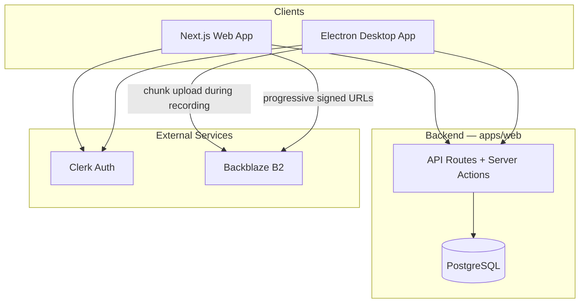
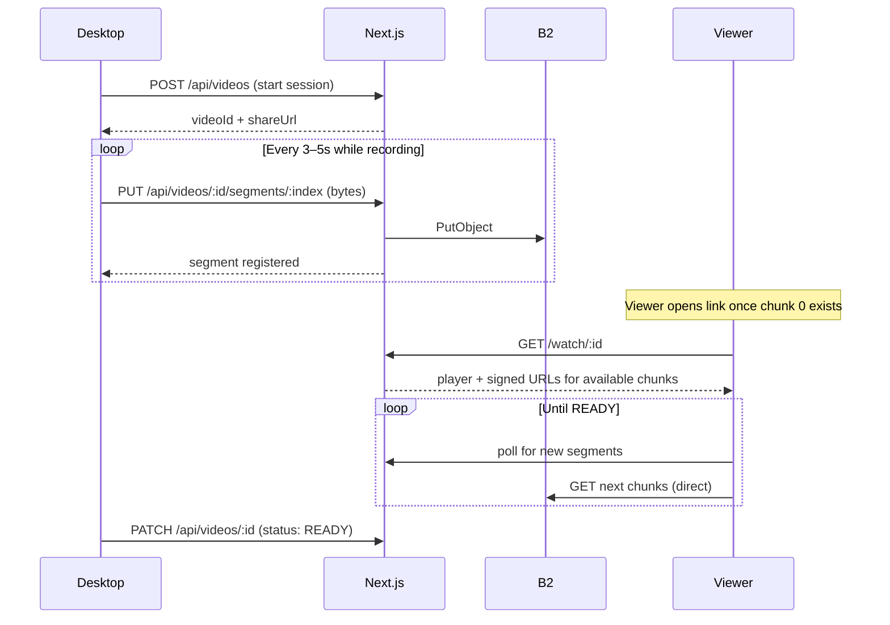
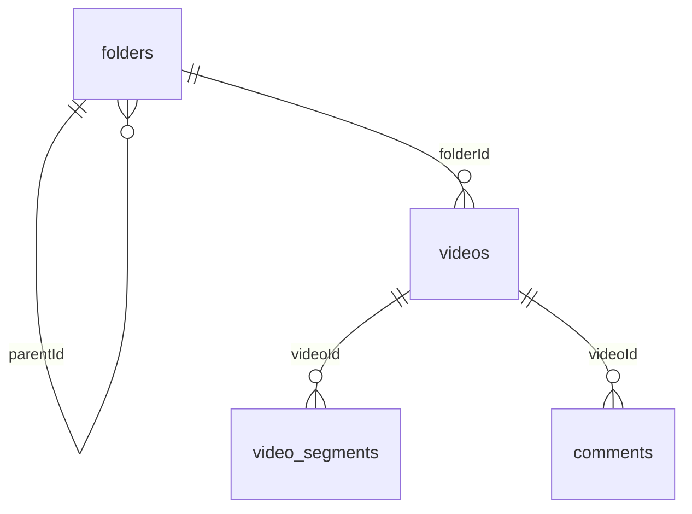

# Architecture

Complete technical design for Knot — a Loom-style async video platform. Record your screen, upload chunks to the cloud **while recording**, and share a link viewers can watch immediately.

For what's built vs. planned, see [Project Status](./project-status.md).

---

## 1. System Overview



**Key idea:** Next.js is the single backend for both clients. Desktop uploads chunk **bytes to Next.js**; the API writes them to B2 with server credentials. The web app plays them back from B2 using short-lived signed GET URLs. Clients never need direct write access to B2 (important behind corporate filters).

### Monorepo layout

```
knot/
├── apps/
│   ├── web/          # Next.js — marketing, dashboard, API (the only app today)
│   └── desktop/      # Electron — capture + Clerk + live B2 upload
├── packages/         # Shared ESLint & TypeScript configs
└── docs/             # This documentation
```

Managed with **pnpm workspaces** + **Turborepo**.

### Tech stack

| Layer | Choice |
|-------|--------|
| Web | Next.js 16 (App Router), React 19, Tailwind v4, shadcn/ui |
| Desktop | Electron (`apps/desktop`) — capture, Clerk, live upload |
| Auth | Clerk |
| Database | PostgreSQL via Drizzle ORM (Neon driver) |
| Storage | Backblaze B2 (S3-compatible API) |

---

## 2. The Core Loop — Instant Cloud Preview

This is what makes Knot feel like Loom: **recording, uploading, and watching all overlap.**

1. User starts recording. A video row is created (`status: RECORDING`).
2. `MediaRecorder` emits a chunk every **3–5 seconds**.
3. Each chunk is immediately uploaded to B2 (via a presigned URL) and registered in Postgres — **while recording continues**.
4. The share link works as soon as the first chunk lands, so a viewer can start watching before recording even finishes.
5. As the viewer plays, the web player keeps fetching newly uploaded chunks. Because upload started during recording, playback usually catches up before the viewer reaches the end.



### Video status

| Status | Meaning |
|--------|---------|
| `RECORDING` | Capturing + uploading. **Already watchable** once chunk 0 exists. |
| `PROCESSING` | Capture stopped, final chunks still uploading. |
| `READY` | All chunks uploaded; recording complete. |
| `FAILED` | Capture or upload error. |

---

## 3. Web App (`apps/web`)

The single backend for browser and desktop.

| Responsibility | How |
|----------------|-----|
| Marketing + dashboard | Server Components + Server Actions |
| Desktop API | Route Handlers under `app/api/` |
| Auth | Clerk (`@clerk/nextjs`) |
| Persistence | Drizzle ORM → PostgreSQL |
| Media | Presigned upload URLs + signed playback URLs |

- **Server Actions** handle dashboard mutations (folders, video metadata).
- **API Routes** serve the desktop app (upload URLs, segment registration, status).

### Dashboard (implemented today)

| Area | Routes / behavior |
|------|-------------------|
| Sidebar | Icon-collapsible nav; active route highlighted; links to Dashboard, Videos, Folders, Settings, Notifications |
| Home | `/dashboard` — recent folders and videos with shared grid/list toggle |
| Folders | `/dashboard/folders` (root list), `/dashboard/folder/:id` (detail); grid or list view; nested CRUD with breadcrumbs |
| Settings | `/dashboard/settings` — Clerk `UserProfile` (account, security) |
| Notifications | `/dashboard/notifications` — read-only list + empty state |
| Videos | `/dashboard/videos` — list only; no create/edit yet |

For remaining web work (video CRUD, watch page, share links, etc.), see [Project Status](./project-status.md#remaining--web-app).

Folder mutations enforce same-level unique names, block circular parent moves, and recursively delete subfolders. Videos in a deleted folder get `folderId` set to null (DB `onDelete: set null`).

### Progressive playback (watch page)

Route: `/watch/[videoId]` (or short link `/r/[slug]`).

1. Load video + available segments from Postgres.
2. Enforce visibility (see §6).
3. Issue signed B2 GET URLs for available chunks.
4. Play chunk 0 immediately; continue through later chunks as they arrive.
   - **MVP:** sequential `<video>` playlist of independently playable WebM segments (matches desktop chunk format).
   - **V1:** server-generated HLS manifest (or remuxed MSE) for better seeking.
   - Show a "still recording" indicator while `status !== READY`.
   - Poll for new segments while recording.
---

## 4. Desktop App (`apps/desktop`)

Primary capture surface. Local capture, Clerk auth, and **live chunk upload** are implemented.

| Module | Status | Responsibility |
|--------|--------|----------------|
| Tray / indicator | Done | Floating bar ready before countdown; system tray menu; global shortcuts |
| Capture | Done | Independently playable ~5s WebM chunks via MediaRecorder rotation; screen / window / region |
| Webcam overlay | Done | Always-on-top preview; drag/resize; shapes circle / square / rectangle; composited for window/region |
| Audio | Done | Mic + optional system/desktop audio |
| Controls | Done | Countdown (after indicator ready), prepare-during-countdown, instant commit at 0, pause / resume / stop, screenshot |
| Auth | Done | `@clerk/electron`, OS keychain tokens, same Clerk app as web, `knot://app/` OAuth |
| Upload | Done | Chunks `PUT` to Next.js → server `PutObject` to B2 → register; share `/watch` URL; `READY`/`FAILED` on stop |

**Capture notes:** VP8/VP9 WebM; each `chunk-NNNN.webm` is a complete file (not timeslice fragments). Written under Electron `userData/recordings/<sessionId>/`.

**Capture modes:** full screen, window, region, and single-frame screenshot (PNG).

**Record sequence:** indicator ready → countdown (capture prepare + cloud session in parallel) → encode starts at 0 → chunks upload while recording → finalize on stop.

Run: `pnpm --filter desktop dev` (see `apps/desktop/README.md`).
---

## 5. Storage (Backblaze B2)

Accessed via the S3-compatible API (`@aws-sdk/client-s3`).

| Operation | Flow |
|-----------|------|
| Upload | Desktop sends chunk bytes to Next.js; server `PutObject` to B2 (no client write to B2). |
| Playback | Next.js returns signed GET URLs after visibility checks; client GETs directly from B2. |

**Object key convention:**

```
{userId}/{videoId}/segments/{index}.webm
{userId}/{videoId}/thumbnail.jpg
```

Credentials (`B2_KEY_ID`, `B2_APPLICATION_KEY`) are **server-only**. Clients never see bucket secrets. Helpers: `apps/web/lib/b2.ts`.

**Network note:** The **API host** must reach B2. A laptop behind Cisco Umbrella that blocks `*.backblazeb2.com` cannot use a *local* Next.js as upload egress — deploy the API (or allowlist B2). Desktop never needs B2 allowlisted.

---

## 6. Auth & Sharing

### Authentication (Clerk)

Single identity provider for web and desktop.

- **Web:** `ClerkProvider` + `clerkMiddleware` in `proxy.ts` (Next.js 16 network boundary — replaces the old `middleware.ts` convention).
- **Desktop:** Clerk session token sent as a bearer token; verified in API routes.
- **Server:** `currentUser()` guard on every protected action.

**Public routes:** `/`, `/sign-in`, `/sign-up`, and `/watch/:id` when the video is `PUBLIC`.
**Protected:** `/dashboard/**`, `/api/**`.

### Visibility model

| Mode | Who can watch |
|------|----------------|
| `PRIVATE` | Owner only (return 404 to others) |
| `PUBLIC` | Anyone with the link |
| `AUTHENTICATED` | Any signed-in Clerk user |

Default on **dashboard** create: `PRIVATE`. Desktop recording sessions (`POST /api/videos`) default to `PUBLIC` so the share link is immediately watchable without forcing sign-in. Visibility is checked **before** any signed B2 URL is issued — including for videos still in `RECORDING`.

### Desktop API (route handlers)

| Method | Path | Purpose |
|--------|------|---------|
| `POST` | `/api/videos` | Start recording session (`RECORDING`), return `shareUrl` |
| `PUT` | `/api/videos/:id/segments/:index` | Upload chunk bytes → B2 PutObject → register |
| `POST` | `/api/videos/:id/upload-url` | Legacy presigned B2 PUT (avoid; firewall-fragile) |
| `POST` | `/api/videos/:id/segments` | Legacy register-only (prefer atomic PUT above) |
| `PATCH` | `/api/videos/:id` | Status transitions (`READY` requires ≥1 segment) |

Routes require Clerk auth (session cookie or `Authorization: Bearer`). CORS allows Electron origin `knot://app` including `PUT`.

### Security boundaries

| Layer | Mechanism |
|-------|-----------|
| Route protection | `clerkMiddleware` in `proxy.ts` on `/dashboard/*` and `/api/*` |
| Mutations | `currentUser()` / `auth()` guard; verify `video.userId === user.id` |
| Uploads | Chunk body → API → PutObject; short-lived signed GET for playback |
| Reads | Signed GET URLs issued only after visibility checks |
| Private IDs | Return 404 (not 403) to avoid enumeration |

---

## 7. Data Model

PostgreSQL is the system of record. Schema: `apps/web/db/schema.ts` (Drizzle ORM). There is **no local users table** — `userId` stores the Clerk user ID string.



### `folders`
Nested folder tree per user (`id`, `userId`, `name`, `parentId?`, timestamps). App enforces that `parentId` belongs to the same user.

### `videos`
Core metadata (binary lives in B2, not Postgres).

| Column | Notes |
|--------|-------|
| `id` | UUID, used in B2 key paths |
| `userId` | Clerk owner |
| `title` / `description` | Title required |
| `visibility` | `PRIVATE` / `PUBLIC` / `AUTHENTICATED` |
| `folderId?` | FK → folders |
| `durationSeconds` | Total duration |
| `segmentCount` | Chunks uploaded so far (grows during recording) |
| `thumbnailKey?` | B2 key for poster image |
| `status` | `RECORDING` / `PROCESSING` / `READY` / `FAILED` |
| timestamps | `createdAt`, `updatedAt` |

*Future:* `shareSlug`, `viewCount`, `publishedAt`.

### `video_segments`
Ordered chunks uploaded during recording. Progressive playback reads them as they're registered.

`id`, `videoId` (FK, cascade delete), `index` (0-based order), `storageKey`, `durationSeconds`, `size`, `createdAt`. **Unique:** `(videoId, index)`.

### `comments` / `notifications` (planned)
- `comments`: timestamped feedback (`timestampSeconds` anchors a point in the video).
- `notifications`: feed with types `COMMENT`, `VIDEO_SHARED`, `RECORDING_READY`, `MENTION`.

### Migrations
Drizzle Kit configured in `apps/web/drizzle.config.ts` (output `./drizzle`). Migrations should be generated and committed as the schema evolves.

---

## 8. Deployment (target)

| Service | Hosting |
|---------|---------|
| Next.js web | Vercel / Node host |
| PostgreSQL | Neon (or any Postgres) |
| B2 bucket | Backblaze region |
| Clerk | Clerk cloud |
| Desktop | GitHub Releases / auto-updater (TBD) |

---

## Non-Goals (initial release)

Real-time collaborative editing · live streaming · mobile native apps · in-browser recording (desktop-first for quality) · adaptive-bitrate transcoding (may add later).
