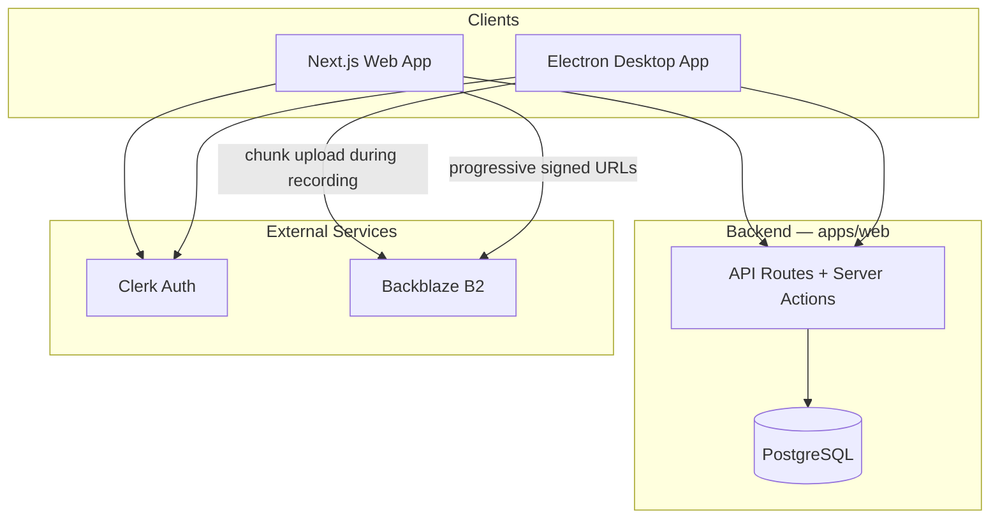
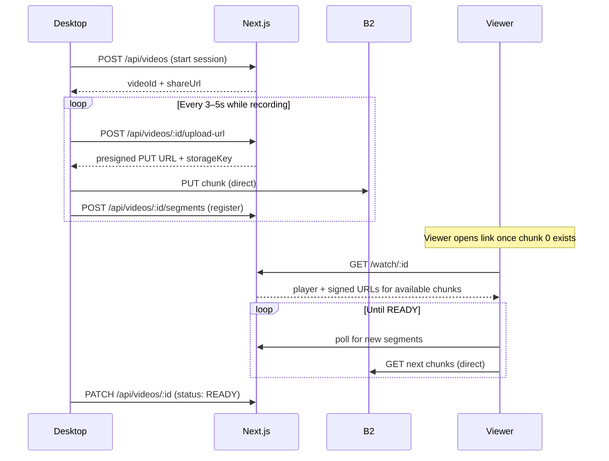
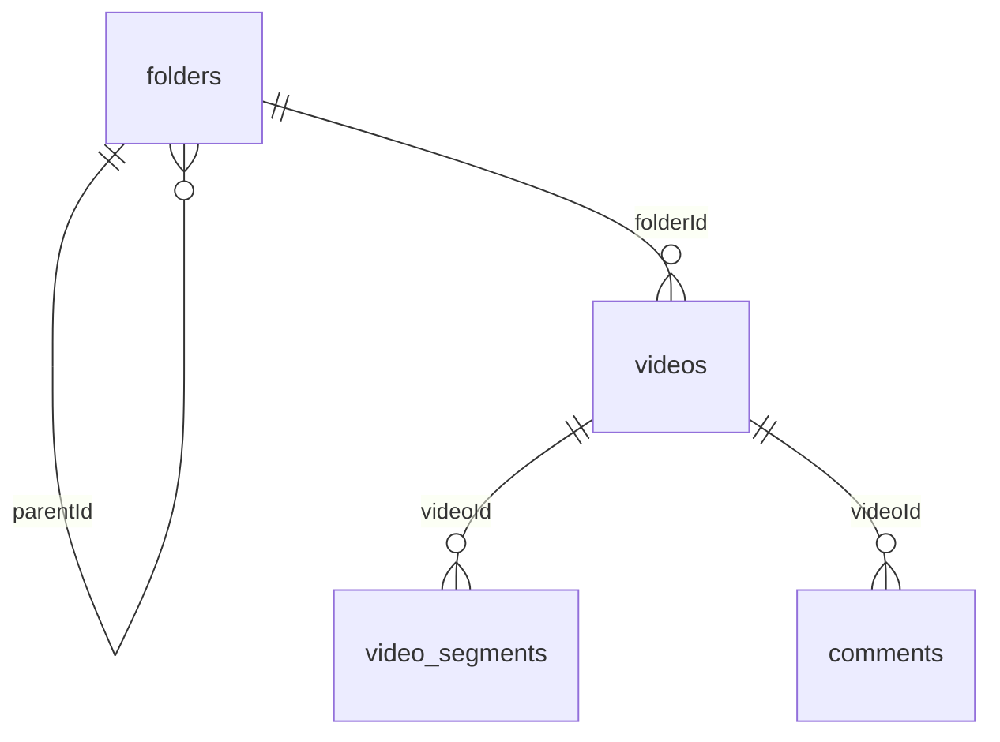

# Architecture

Complete technical design for Knot — a Loom-style async video platform. Record your screen, upload chunks to the cloud **while recording**, and share a link viewers can watch immediately.

For what's built vs. planned, see [Project Status](./project-status.md).

---

## 1. System Overview



**Key idea:** Next.js is the single backend for both clients. Video bytes never pass through Next.js — the desktop app uploads chunks **directly** to B2, and the web app plays them back **directly** from B2 using short-lived signed URLs.

### Monorepo layout

```
knot/
├── apps/
│   ├── web/          # Next.js — marketing, dashboard, API (the only app today)
│   └── desktop/      # Electron — capture + chunked upload (planned)
├── packages/         # Shared ESLint & TypeScript configs
└── docs/             # This documentation
```

Managed with **pnpm workspaces** + **Turborepo**.

### Tech stack

| Layer | Choice |
|-------|--------|
| Web | Next.js 16 (App Router), React 19, Tailwind v4, shadcn/ui |
| Desktop | Electron (planned) |
| Auth | Clerk |
| Database | PostgreSQL via Drizzle ORM (Neon driver) |
| Storage | Backblaze B2 (S3-compatible API) |

---

## 2. The Core Loop — Instant Cloud Preview

This is what makes Knot feel like Loom: **recording, uploading, and watching all overlap.**

1. User starts recording. A video row is created (`status: RECORDING`).
2. `MediaRecorder` emits a chunk every **3–5 seconds**.
3. Each chunk is immediately uploaded to B2 (via a presigned URL) and registered in Postgres — **while recording continues**.
4. The share link works as soon as the first chunk lands, so a viewer can start watching before recording even finishes.
5. As the viewer plays, the web player keeps fetching newly uploaded chunks. Because upload started during recording, playback usually catches up before the viewer reaches the end.



### Video status

| Status | Meaning |
|--------|---------|
| `RECORDING` | Capturing + uploading. **Already watchable** once chunk 0 exists. |
| `PROCESSING` | Capture stopped, final chunks still uploading. |
| `READY` | All chunks uploaded; recording complete. |
| `FAILED` | Capture or upload error. |

---

## 3. Web App (`apps/web`)

The single backend for browser and desktop.

| Responsibility | How |
|----------------|-----|
| Marketing + dashboard | Server Components + Server Actions |
| Desktop API | Route Handlers under `app/api/` |
| Auth | Clerk (`@clerk/nextjs`) |
| Persistence | Drizzle ORM → PostgreSQL |
| Media | Presigned upload URLs + signed playback URLs |

- **Server Actions** handle dashboard mutations (folders, video metadata).
- **API Routes** serve the desktop app (upload URLs, segment registration, status).

### Dashboard (implemented today)

| Area | Routes / behavior |
|------|-------------------|
| Sidebar | Icon-collapsible nav; active route highlighted; links to Dashboard, Videos, Folders, Settings, Notifications |
| Folders | `/dashboard/folders` (root list), `/dashboard/folder/:id` (detail); grid or list view; nested CRUD with breadcrumbs |
| Settings | `/dashboard/settings` — Clerk `UserProfile` (account, security) |
| Videos | `/dashboard/videos` — list only; no create/edit yet |
| Home | `/dashboard` — placeholder (recent activity not wired) |

Folder mutations enforce same-level unique names, block circular parent moves, and recursively delete subfolders. Videos in a deleted folder get `folderId` set to null (DB `onDelete: set null`).

### Progressive playback (watch page)

Route: `/watch/[videoId]` (or short link `/r/[slug]`).

1. Load video + available segments from Postgres.
2. Enforce visibility (see §6).
3. Issue signed B2 GET URLs for available chunks.
4. Play chunk 0 immediately; append new chunks as they arrive.
   - **MVP:** Media Source Extensions (append WebM chunks).
   - **V1:** server-generated HLS manifest for better seeking.
   - Show a "still recording" indicator while `status !== READY`.

---

## 4. Desktop App (`apps/desktop`) — planned

The primary capture surface. Not yet in the repo.

| Module | Responsibility |
|--------|----------------|
| Tray | Global shortcut, menu (record, screenshot, open dashboard) |
| Capture | `desktopCapturer` + `MediaRecorder` with timed chunks; optional webcam overlay |
| Upload | Fetch presigned URL → PUT each chunk to B2 → register segment, **during recording** |
| Auth | Clerk session, stored in OS keychain, sent as `Authorization: Bearer <token>` |

**Capture notes:** VP8/VP9 WebM output; system + mic audio via `getUserMedia`; webcam overlay via canvas compositing (shapes: circle / square / rect). An optional local buffer of recent chunks allows a quick self-preview — a recorder convenience, not the main playback path.

**Capture modes:** full screen, window, region, and single-frame screenshot (PNG/JPEG to B2).

---

## 5. Storage (Backblaze B2)

Accessed via the S3-compatible API (`@aws-sdk/client-s3`).

| Operation | Flow |
|-----------|------|
| Upload | Next.js returns a presigned PUT URL (~15 min TTL) scoped to one object key; client PUTs directly to B2. |
| Playback | Next.js returns signed GET URLs after visibility checks; client GETs directly from B2. |

**Object key convention:**

```
{userId}/{videoId}/segments/{index}.webm
{userId}/{videoId}/thumbnail.jpg
```

Credentials (`B2_KEY_ID`, `B2_APPLICATION_KEY`) are **server-only**. Clients never see bucket secrets. A prototype upload script exists at `apps/web/server-actions/b2.ts` (not yet productized).

---

## 6. Auth & Sharing

### Authentication (Clerk)

Single identity provider for web and desktop.

- **Web:** `ClerkProvider` + `clerkMiddleware` in `proxy.ts` (Next.js 16 network boundary — replaces the old `middleware.ts` convention).
- **Desktop:** Clerk session token sent as a bearer token; verified in API routes.
- **Server:** `currentUser()` guard on every protected action.

**Public routes:** `/`, `/sign-in`, `/sign-up`, and `/watch/:id` when the video is `PUBLIC`.
**Protected:** `/dashboard/**`, `/api/**`.

### Visibility model

| Mode | Who can watch |
|------|----------------|
| `PRIVATE` | Owner only (return 404 to others) |
| `PUBLIC` | Anyone with the link |
| `AUTHENTICATED` | Any signed-in Clerk user |

Default on create: `PRIVATE`. Visibility is checked **before** any signed B2 URL is issued — including for videos still in `RECORDING`.

### Security boundaries

| Layer | Mechanism |
|-------|-----------|
| Route protection | `clerkMiddleware` in `proxy.ts` on `/dashboard/*` and `/api/*` |
| Mutations | `currentUser()` guard; verify `video.userId === user.id` |
| Uploads | Short-lived presigned PUT URLs scoped to one key |
| Reads | Signed GET URLs issued only after visibility checks |
| Private IDs | Return 404 (not 403) to avoid enumeration |

---

## 7. Data Model

PostgreSQL is the system of record. Schema: `apps/web/db/schema.ts` (Drizzle ORM). There is **no local users table** — `userId` stores the Clerk user ID string.



### `folders`
Nested folder tree per user (`id`, `userId`, `name`, `parentId?`, timestamps). App enforces that `parentId` belongs to the same user.

### `videos`
Core metadata (binary lives in B2, not Postgres).

| Column | Notes |
|--------|-------|
| `id` | UUID, used in B2 key paths |
| `userId` | Clerk owner |
| `title` / `description` | Title required |
| `visibility` | `PRIVATE` / `PUBLIC` / `AUTHENTICATED` |
| `folderId?` | FK → folders |
| `durationSeconds` | Total duration |
| `segmentCount` | Chunks uploaded so far (grows during recording) |
| `thumbnailKey?` | B2 key for poster image |
| `status` | `RECORDING` / `PROCESSING` / `READY` / `FAILED` |
| timestamps | `createdAt`, `updatedAt` |

*Future:* `shareSlug`, `viewCount`, `publishedAt`.

### `video_segments`
Ordered chunks uploaded during recording. Progressive playback reads them as they're registered.

`id`, `videoId` (FK, cascade delete), `index` (0-based order), `storageKey`, `durationSeconds`, `size`, `createdAt`. **Unique:** `(videoId, index)`.

### `comments` / `notifications` (planned)
- `comments`: timestamped feedback (`timestampSeconds` anchors a point in the video).
- `notifications`: feed with types `COMMENT`, `VIDEO_SHARED`, `RECORDING_READY`, `MENTION`.

### Migrations
Drizzle Kit configured in `apps/web/drizzle.config.ts` (output `./drizzle`). Migrations should be generated and committed as the schema evolves.

---

## 8. Deployment (target)

| Service | Hosting |
|---------|---------|
| Next.js web | Vercel / Node host |
| PostgreSQL | Neon (or any Postgres) |
| B2 bucket | Backblaze region |
| Clerk | Clerk cloud |
| Desktop | GitHub Releases / auto-updater (TBD) |

---

## Non-Goals (initial release)

Real-time collaborative editing · live streaming · mobile native apps · in-browser recording (desktop-first for quality) · adaptive-bitrate transcoding (may add later).
